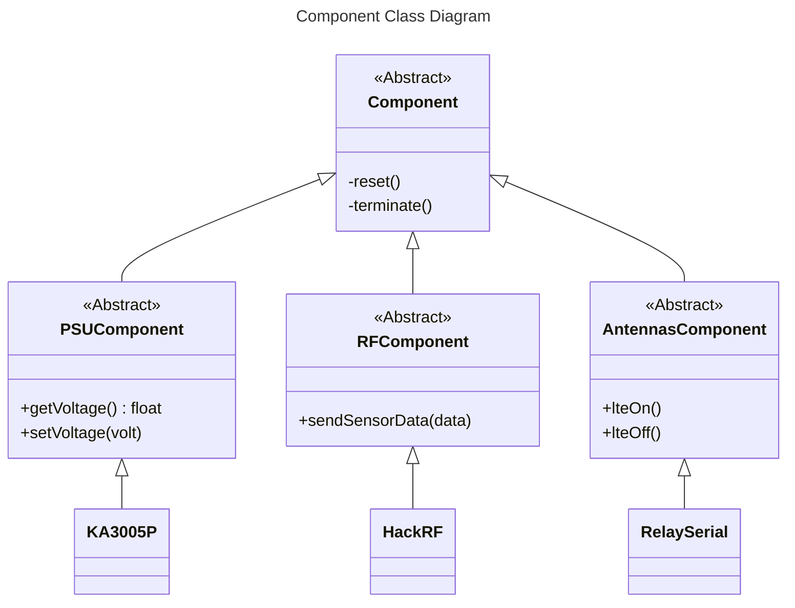

# Class Diagrams

<!-- TOC -->
- [Class Diagrams](#class-diagrams)
  - [Test](#test)
    - [Toc](#toc)
  - [No](#no)
<!-- TOC -->

[View Site](https://log1k-png.github.io/pages/)

<https://log1k-png.github.io/pages/>



```python
print("Hello Wrold !")
```

```shell
cd Documents
```

## Test

### Toc

Hey  
H<sub>2</sub>O  
X<sup>2</sup>  
<http://google.com>

> [!NOTE]
> Useful information that users should know, even when skimming content.
<!--  -->
> [!TIP]
> Helpful advice for doing things better or more easily.
<!--  -->
> [!IMPORTANT]
> Key information users need to know to achieve their goal.
<!--  -->
> [!WARNING]
> Urgent info that needs immediate user attention to avoid problems.
<!--  -->
> [!CAUTION]
> Advises about risks or negative outcomes of certain actions.

## No

~~Strikethrough~~  


| Syntax      | Description | Test Text     |
| :---        |    :----:   |          ---: |
| Header      | Title       | Here's this   |
| Paragraph   | Text        | And more      |
| Hello | Ce test | fonctionne |

- [x] Write the press release
- [x] Update the website
- [ ] Contact the media

Here's a simple footnote,[^1] and here's a longer one.[^bignote]

Gone camping! :tent: Be back soon.  

[^1]: This is the first footnote.

[^bignote]: Here's one with multiple paragraphs and code.

    Indent paragraphs to include them in the footnote.

    `{ my code }`

    Add as many paragraphs as you like.
